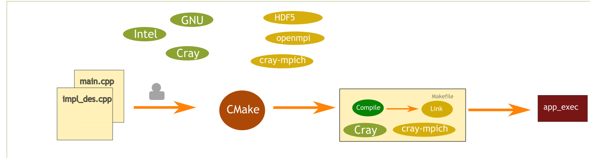

# Introduction

CMake is a framework that makes it easier to build code on multiple programming environments.

## The compilation process

When compiling one starts from a collection of source code files and folders. A sequence of steps are usually required to convert uman-readable text code to binary code, which can run from a machine.
This will tipically involve invoking a compiler and linking with external libraries.
The instrucions to generate the binary can be encoded in a **build system**. On an UNIX system, a common build system is a `Makefile`. Makefiles are able to describe various steps in the compilation process.
THe compilation process will typically involve invoking externally available compilers and linking to system libraries. Different systems will have different compilers available, different library implementations and will live on different paths on the system. The Makefile build system is not able to automatically find the paths or the version of the libraries and compilers available on the systems.
Thus, these often need to be edited manually by the user in the Makefile, a process which can be time consuming and prone to error

<figure markdown>

<figcaption> Compilation process using a Makefile. The user needs to manually specify the paths to compilers and libraries to be used during the compilation process.</figcaption>
</figure>

## How does CMake help ?

CMake automates the processes of defining and finding compilers and libraries on the systems.
CMake will first run a configure step where it figures out which compiler to use, which paths to include , what libraries to link etc . That information is used to generate a build system.
The second step of the process then consists in executing the build systems in order to generate the binary files.
<figure markdown>

<figcaption> Compilation process using CMake. The user may have to provide options to the cmake build script provided by the package developer. Once configured the framework will generate a build system, often a Makefile describing all the compilation steps on the target machine.</figcaption>
</figure>

## What is CMake ?

- **A build system generator**: CMake is a framework to generate a build systems
- **A programming langauge**: CMake is a domain specific language to describe the steps necessary to build a system.

## Main features of CMake

- **Build abstraction**: No need to define all commands in the compilation process. One needs only specify which files need to be compiled, what exectuables and libraries need to be produces, which libraries to link etc.. . Cmake is reponsible for generating build dependencies, creating Makefiles, invoking the compiler etc.
- **Portability** : CMake is able to generate a veriety of build systems for many platforms ( including Linux, Windows and Mac). For Unix systems Makefile is the default build system
- **Out of source build**: Intermediary build files are generated in a build directory separated from the source directory. This prevents polluting the source directory and allows multiple builds from the same source code directory.

## Drawbacks of CMake

- **Troubleshooting** : When configuration fails it can be difficult to diagnose and fix the issue.
